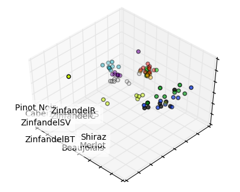
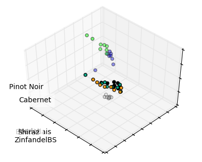

# Data analysis of wines assayed by indicator displacement assay in the Anslyn lab using Python/sklearn

Principal component analysis (PCA) of data obtained in 2010 in the Freshman Research Initiative, Anslyn Labs was redone using Python/sklearn. Explained variance and explained varaiance ratios were the same as the ones obtained
previously using [XLStat](https://www.xlstat.com/en/). Here is the 3D plot of the transformed data:

Additionally, KMeans clustering was done on the same data. The plot below shows analysis from KMeans clustering with n_clusters=4.

## References:
PCA example using the iris dataset:
http://scikit-learn.org/stable/auto_examples/decomposition/plot_pca_iris.html#sphx-glr-auto-examples-decomposition-plot-pca-iris-py

KMeans clustering example using the iris dataset:
http://scikit-learn.org/stable/auto_examples/cluster/plot_cluster_iris.html#sphx-glr-auto-examples-cluster-plot-cluster-iris-py
