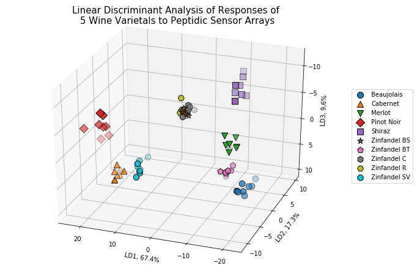

# Discrimination of Wine Varietals Using Indicator Displacement Assay (Anslyn Freshman Research Initiative): Reprocessing of Data Using Python

Wine varietals were used as test mixtures to optimize chemical array sensors created in the Anslyn labs (FRI). 

The chemical sensor arrays work so that the arrays' UV-vis absorbance change upon indicator displacement with the components of the test mixture. UV-vis absorbance readings were obtained at different wavelengths so that the data is multivariate. This data is then amenable to machine learning, such as principal component analysis and linear discriminant analysis.

The following plots were obtained from analysis using Python, and were mostly consistent with the results obtained using a statistical software, [XLStat](https://www.xlstat.com/en/) (the publication for the original study can be found [here](https://pubs.rsc.org/en/content/articlelanding/2011/sc/c0sc00487a#!divAbstract)). 

Explained variance and explained varaiance ratios were the same as the ones previously obtained. Here is the 3D plot of the transformed data (linear discriminant analysis):

## References:
PCA example using the iris dataset:
http://scikit-learn.org/stable/auto_examples/decomposition/plot_pca_iris.html#sphx-glr-auto-examples-decomposition-plot-pca-iris-py
