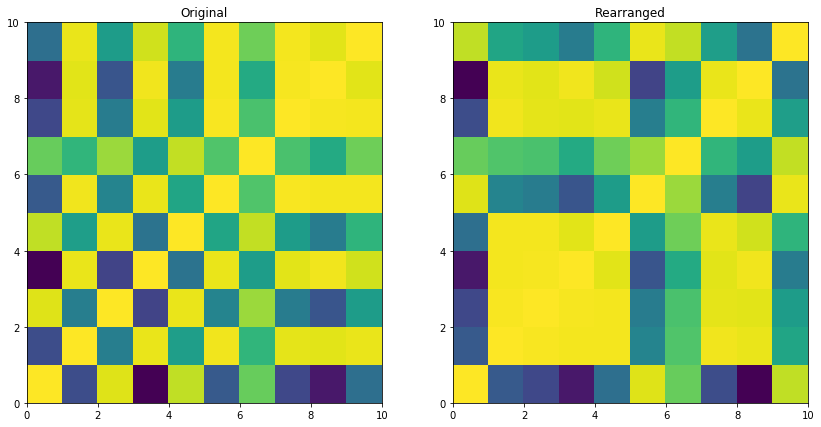
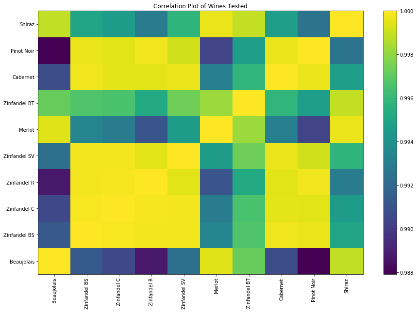

# Discrimination of Wine Varietals Using Indicator Displacement Assay (Anslyn Freshman Research Initiative): Reprocessing of Data Using Python

Wine varietals were used as test mixtures to optimize chemical array sensors created in the Anslyn labs (FRI). 

The chemical sensor arrays work so that the arrays' UV-vis absorbance change upon indicator displacement with the components of the test mixture. UV-vis absorbance readings were obtained at different wavelengths so that the data is multivariate. This data is then amenable to machine learning, such as principal component analysis and linear discriminant analysis.

The following plots were obtained from analysis using Python, and were mostly consistent with the results obtained using a statistical software, [XLStat](https://www.xlstat.com/en/) (the publication for the original study can be found [here](https://pubs.rsc.org/en/content/articlelanding/2011/sc/c0sc00487a#!divAbstract) and a pdf can be found [here](https://repositories.lib.utexas.edu/bitstream/handle/2152/41056/2010_Umali.pdf?sequence=1)). 

Explained variance and explained varaiance ratios were the same as the ones previously obtained. Here is the 3D plot of the transformed data (linear discriminant analysis):

The Jupyter Notebook can be found [here](https://github.com/mudspringhiker/pca_kmeans_anslynwines/blob/master/Analysis%20of%20FRI%20Data%20Using%20Python.ipynb).

The same dataset were analyzed using spectral co-clustering.

First, the correlations of the wines were calculated using [pandas correlation function](https://pandas.pydata.org/pandas-docs/stable/generated/pandas.DataFrame.corr.html). The correlations were analyzed for clusters using [spectral co-clustering](](http://scikit-learn.org/stable/auto_examples/bicluster/plot_spectral_coclustering.html) provided by the scikit-learn package. Plotting the correlations of the wines based on clusters results in the following (the right was rearranged to show the clusters).

Re-plotting shows that the clusters were of the same varietal, mostly. 

The Jupyter notebook for this is [here](https://github.com/mudspringhiker/pca_kmeans_anslynwines/blob/master/spectralcoclustering_5wines0720.ipynb).

## References:
PCA example using the iris dataset:
http://scikit-learn.org/stable/auto_examples/decomposition/plot_pca_iris.html#sphx-glr-auto-examples-decomposition-plot-pca-iris-py

Using Python for Research (HarvardX: PH526x)
https://courses.edx.org/courses/course-v1:HarvardX+PH526x+3T2016/course/
